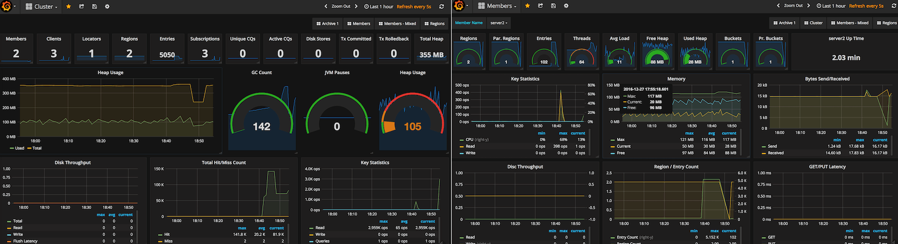
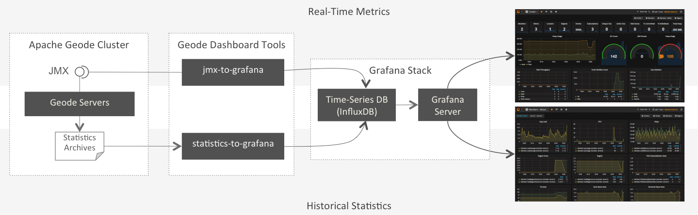

# Apache Geode - Grafana Dashboard

Apache Geode toolset for analysing and visualising historical and real-time statistics with Grafana.

Following sub-projects support real-time ([jmx-to-grafana](https://github.com/tzolov/geode-dashboard/tree/master/jmx-to-grafana)) and historical ( [statistics-to-grafana](https://github.com/tzolov/geode-dashboard/tree/master/statistics-to-grafana) ) metrics monitoring.
## [jmx-to-grafana](https://github.com/tzolov/geode-dashboard/tree/master/jmx-to-grafana) (in progress)
stream Geode cluster real-time metrics to Grafana dashboards.

## [statistics-to-grafana](https://github.com/tzolov/geode-dashboard/tree/master/statistics-to-grafana) 
Leverage Grafana (metric & analytic dashboards tool) for querying, visualizing and analysing Apache Geode & Gemfire Statistics archives. 
Geode can collect statistics about the distributed system and persist it in archive files. The `statistics-to-grafana` tool loads later into a Grafana supported time-series database such as InfluxDB. Then one can build comprehensive Grafana dashboards to visualize and analyse the statistics data.

## Architecture Overview

