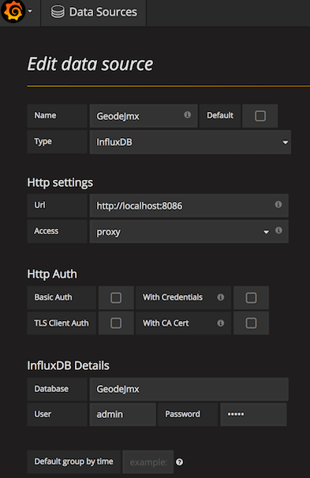
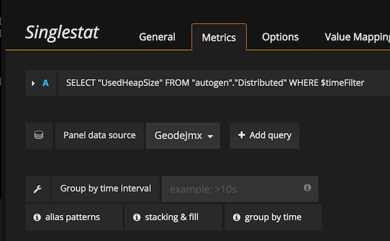
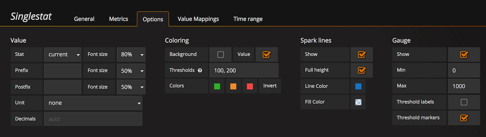
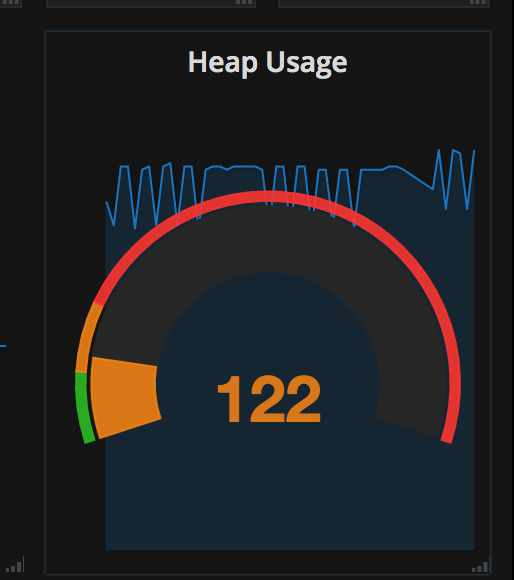

# Apache Geode real-time JMX Metrics Plot with Grafana

[</img>](https://www.youtube.com/watch?v=e2UlWm1w2yY) [Apache Geode](http://geode.apache.org/) uses a federated [Open MBean](http://docs.oracle.com/cd/E19206-01/816-4178/6madjde4v/index.html) strategy to manage and monitor all members of the distributed system. Your Java classes interact with a single MBeanServer that aggregates MBeans from other local and remote members. Using this strategy gives you a consolidated, single-agent view of the distributed system.					
One can use generic JMX clients to monitor or manage the Geode distributed system by using JMX compliant tools such as [JConsole](https://docs.oracle.com/javase/8/docs/technotes/guides/management/jconsole.html) and [Geode Pulse](http://geode.apache.org/docs/guide/tools_modules/pulse/chapter_overview.html).
  
`jmx-to-grafana` feeds Geode MBeans metrics data into time-series databases (such as InfluxDB). Later is used in turn to 
feed the [Gfafana](http://grafana.org/) dashboards. Grafana allows to build comprehensive dashboards.  

The [Geode JMX Grafana Dashboard Video](https://www.youtube.com/watch?v=oc7U73Vp05M) illustrates the approach. It shows how to deploy and start the `jmx-to-grafana` 
and how to build Grafana dashboards using the geode jmx feed. 


## Build
Get the source code from github
```
git clone https://github.com/tzolov/geode-dashboard.git
```

From within the geode-dashboard/jmx-to-grafana directory run
```
mvn clean install
```

## Quick Start
Build Grafana dashboard to plot real-time metrics of Geode cluster. 
[Grafana](http://docs.grafana.org/installation) and [InfluxDB](https://docs.influxdata.com/influxdb/v1.1/introduction/installation) have to be installed first. Samples below expect InfluxDB on `http://localhost:8086` and Grafana on `http://localhost:30000`. 

#### Start Jmx To Grafana daemon

```
java -jar ./target/jmx-to-grafana-0.0.1-SNAPSHOT.jar 
   --influxUrl=http://localhost:8086 
   --influxDatabaseName=GeodeJmx 
   --mbeanHostName=localhost 
   --mbeanPort=1199
```

Complete list of statistics-to-grafana parameters:

| Property Name | Default Value | Description |
| ------------- | ------------- | ------------ |
| influxUrl | http://localhost:8086 | InfulxDB connection URL |
| influxUser | admin | InfuxDB connection username |
| influxPassword | admin | InfluxDB connection password |
| cleanDatabaseOnLoad | false | If set the target TSDB will be (re)created on every statistics load |
| influxRetentionPolicy | autogen | InfluxDB retention policy |
| mbeanHostName | None |  |
| influxDatabaseName | GeodeJmx | Database to load the jmx metrics into. Same database is used to load metrics for cluster members. The `member` is used to distinct the time-series form different members. |
| mbeanPort | 1190 |  |
| cronExpression | 0 0/1 * * * ? | Time interval for pulling JMX metrics from Geode and load them into InfluxDB. Defaults to 1m. Use `--cronExpression="..."` syntax to set the expression from the command line. |

Following table show which Geode MBeans are exposed into InfluxDB time-series

| Geode MBean Name | InfluxDB Measurement Name | Description |
| ------------- | ------------- | ------------ |
| [DistributedSystemMXBean](http://gemfire.docs.pivotal.io/geode/managing/management/list_of_mbeans_full.html#topic_14E3721DD0CF47D7AD8C742DFBE9FB9C__section_4D7A4C82DD974BB5A5E52B34A6D888B4) - GemFire:type=Distributed,service=System | Distributed | System-wide aggregate MBean that provides a high-level view of the entire distributed system including all members (cache servers, peers, locators) and their caches. At any given point of time, it can provide a snapshot of the complete distributed system and its operations. |
| [MemberMXBean](http://gemfire.docs.pivotal.io/geode/managing/management/list_of_mbeans_full.html#topic_48194A5BDF3F40F68E95A114DD702413__section_796A989549304BF7A536A33A913322A4) - GemFire:type=Member,member=\<name-or-dist-member-id\> | Members | Member’s local view of its connection and cache. It is the primary gateway to manage a particular member. It exposes member level attributes and statistics. |
| [RegionMXBean](http://gemfire.docs.pivotal.io/geode/managing/management/list_of_mbeans_full.html#topic_48194A5BDF3F40F68E95A114DD702413__section_577A666924E54352AF69294DC8DEFEBF) - GemFire:type=Member,service=Region,name=\<regionName\>,member=\<name-or-dist-member-id\> | Regions | Member’s local view of region. |


#### Build Grafana Goede JMX Dashboard
|  |  |
| ------------- | ------------ |
|  | Define datasource:`GeodeJmx` to the `GeodeJmx` Influx database. Set appropriate InfluxDB URL and credentials. |
|  | Create Geode Heap Usage Gauge. Create `Singlestat` panel and select `GeodeJmx` as datasource. Define query: `SELECT "UsedHeapSize" FROM "autogen"."Distributed" WHERE $timeFilter`. |
|  | Within the `Options` tab set the value stat to `current`, check the `Spark Line Show` and `Gauge Show` boxes. |
|  | Result gauge would look like this |

Explore the `Predefined Dashboards` for more comprehensive dashboards panels. 

#### Predefined Dashboards
Use or customize the sample [Geode Grafana Dashboards](./src/main/resources/dashboards) to visualize Cluster, Members or Regions view of the distributed system. 