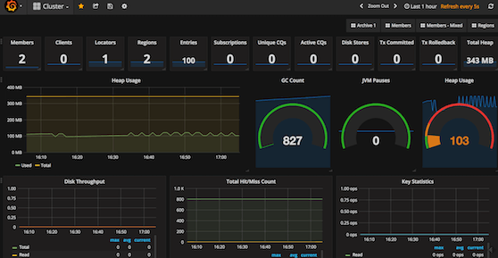
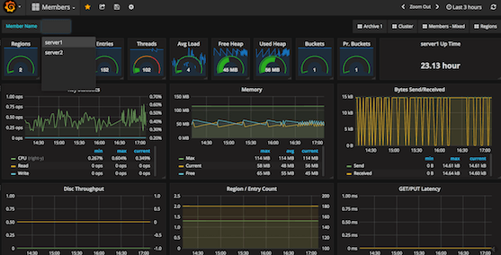
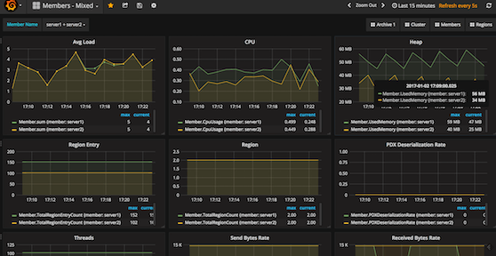
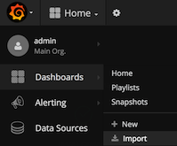

# Geode - Grafana Dashboards
Predefined Grafana dashboards useful to visualize Geode JMX metrics. 

| Dashboard File | Description |
| ------------- | ------------ |
| [GeodeClusterView.json](https://github.com/tzolov/geode-dashboard/tree/master/jmx-to-grafana/src/resources/dashboard/GeodeClusterView.json) | The cluster view is a high-level overview of the Geode distributed system. Cluster view show statistics such as memory usage, JVM pauses, and throughput. You can use the cluster view to drill down into details for individual members and regions in the distributed system. | 
| [GeodeMembersView.json](https://github.com/tzolov/geode-dashboard/tree/master/jmx-to-grafana/src/resources/dashboard/GeodeMembersView.json) | Displays information for individual Geode members in the Cluster. Such as the number of regions, memory, threads ports. | 
| [GeodeMembersCombinedView.json](https://github.com/tzolov/geode-dashboard/tree/master/jmx-to-grafana/src/resources/dashboard/GeodeMembersCombinedView.json)  | Can combine, correlate and compare metrics from multiple Members  | 
| [GeodeRegionView.json](https://github.com/tzolov/geode-dashboard/tree/master/jmx-to-grafana/src/resources/dashboard/GeodeRegionView.json) | The Region View provides a comprehensive overview for individual Regions in the Geode distributed system | 

## Import Dashboards
* By default `jxm-to-grafana` loads all metrics series in the `GeodeJmx` InfluxDB database. Make sure that `GeodeJmx` is defined as Grafana datasource. 
* From Grafana's `Dashboards` menu select `Import` option and upload one of the predefined json dashboards.  

 